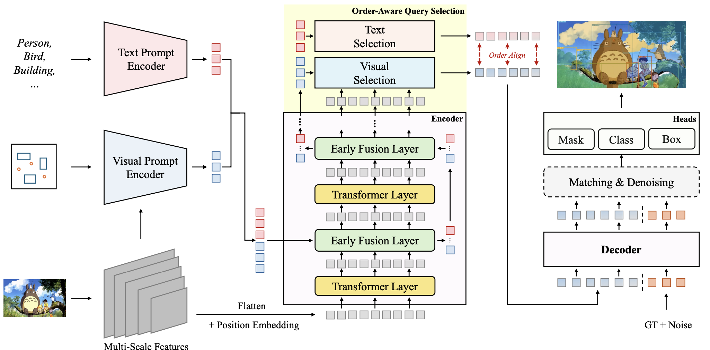
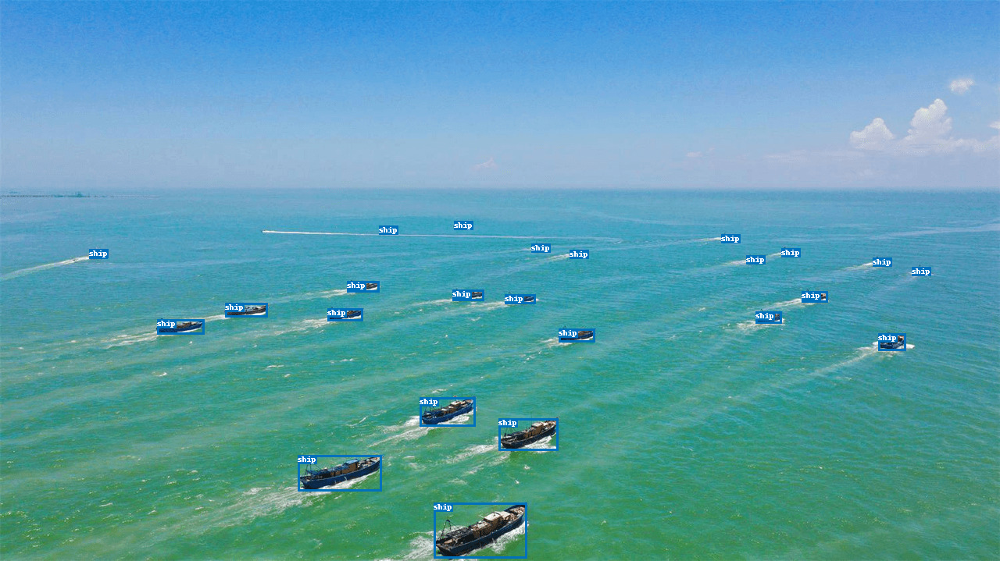
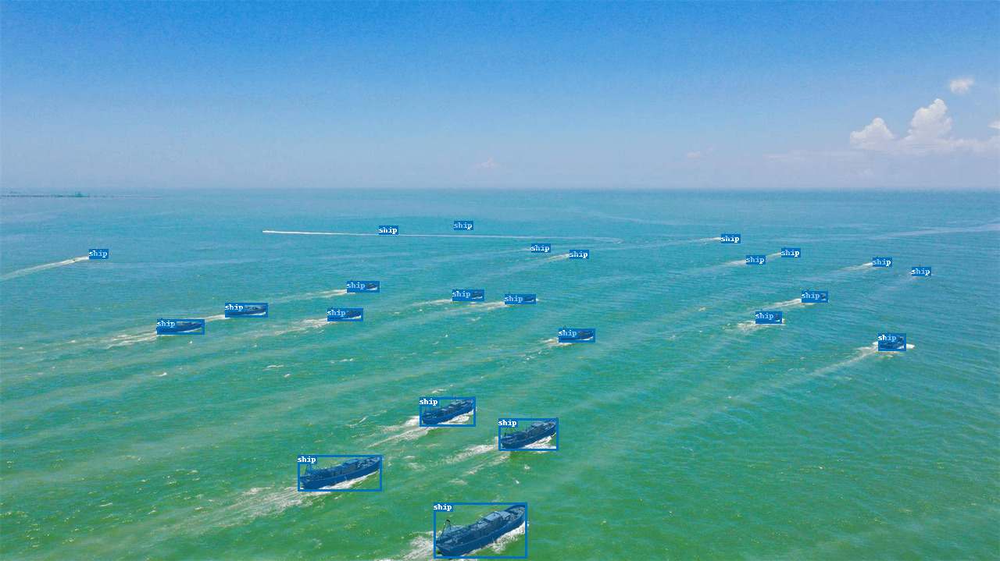
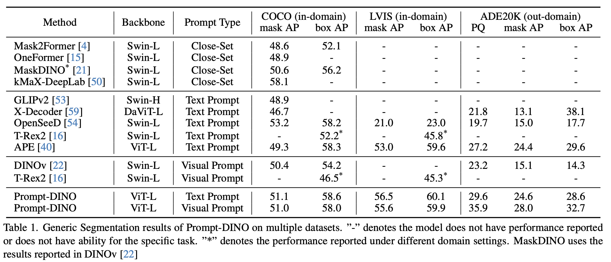
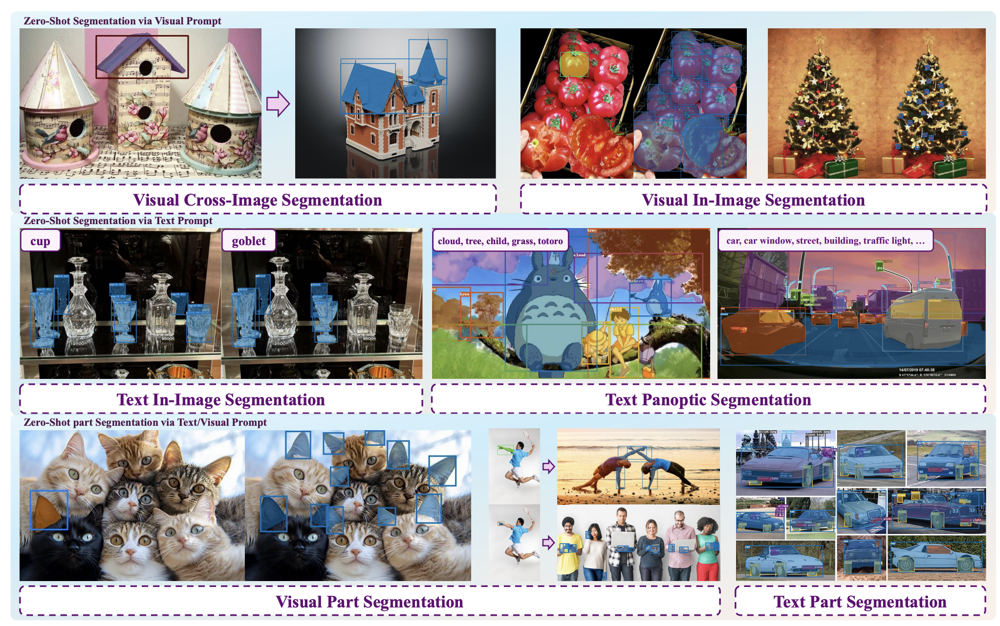

# Text-guided Visual Prompt DINO for Generic Segmentation (Prompt-DINO)
This repo is the official implementation of [Text-guided Visual Prompt DINO for Generic Segmentation](https://arxiv.org/abs/2508.06146), by Yuchen Guan, Chong Sun, Canmiao Fu, Zhipeng Huang, Chun Yuan, Chen Li.

<p align="center">
  
</p>
* Gradio Demo

Prompt-DINO is a unified model for open vocabulary detection and segmentation, capable of simultaneously outputting detection bounding boxes and segmentation masks. It accepts both text prompts and visual prompts, allowing it to perform detection and segmentation of the specified categories based on the given prompts. Prompt-DINO has been trained using over 10 million datasets and hundreds of millions of target instance boxes. It demonstrates strong performance in the field of open vocabulary detection and segmentation.

## Highlights
* We have constructed annotations for hundreds of millions of instances, each accompanied by detailed concept descriptions. In the domain of open-source open-set object detection/segmentation, we used the highest number of concept-annotated instances.
* We possess excellent detection and segmentation capabilities, achieving highly competitive results on mainstream evaluation datasets such as COCO, LVIS, and ADE20K.
* We support both text prompts and visual prompts, and simultaneously enable detection and segmentation.

## Usage Recommendations
* We accept (text, image) or (box, image) pair as input, and simultaneously output detection boxes, as well as segmentation mask. 
* Since we use early fusion, the fewer the input prompt words, the better the results. It is recommended to keep the number of prompt words within 16.
* Temporally, we only accept English words, the words should be split with ".". For example, an input prompt could be "apple.pair".
* Since some instances in English can be expressed using different synonyms, you can try replacing them with synonyms to achieve a better experience. For example, "person" and "people".

## :hammer_and_wrench: Install 
* Compile MultiScaleDeformbleAttention:
```bash
cd WeVisionOne/pixel_decoder/ops && sh make.sh
```
* Compile Detectron2
```bash
cd /path_to_detectron2/detectron2/ && python setup.py install
```
* Compile MMCV
```bash
cd /path_to_mmcv/mmcv/ && MMCV_WITH_EXT=1 MMCV_WITH_OPS=1 MAX_JOBS=8 python setup.py build_ext && MMCV_WITH_OPS=1 python setup.py develop
```
* Install other necessary libraries
```bash
pip3 install timm -i https://mirrors.tencent.com/pypi/simple/ 
pip3 install pycocotools -i https://mirrors.tencent.com/pypi/simple/
pip3 install omegaconf==2.4.0.dev2 -i https://mirrors.tencent.com/pypi/simple/
pip3 install shapely -i https://mirrors.tencent.com/pypi/simple/
pip3 install transformers -i https://mirrors.tencent.com/pypi/simple/
pip3 install panopticapi -i https://mirrors.tencent.com/pypi/simple/
```
## Demo
We provide both a script and a Gradio demo:
* Script Demo
```bash
cd Inference
IMG_PATH=resources/ships.jpg
python text_prompt.py --config-file configs/text_model_cfgs.yaml --img_path $IMG_PATH --text_prompts "ship"
```
Two outputs will be produced in "./output" folder, they should be like:
<p align="center">
  
  
</p>

* Gradio Demo

```bash
cd Inference
python gradio_demo.py
```
## Results
* Quantative Resutls
<p align="center">
  
</p>

* Qualitative Resutls
<p align="center">
  
</p>

## :black_nib: Citation

If you find our work helpful for your research, please consider citing the following BibTeX entry.   

```bibtex
@inproceedings{guan2025text,
  title={Text-guided Visual Prompt DINO for Generic Segmentation},
  author={Guan, Yuchen and Sun, Chong and Fu, Canmiao and Huang, Zhipeng and Yuan, Chun and Li, Chen},
  booktitle={Proceedings of the IEEE/CVF International Conference on Computer Vision},
  pages={21288--21298},
  year={2025}
}
```
